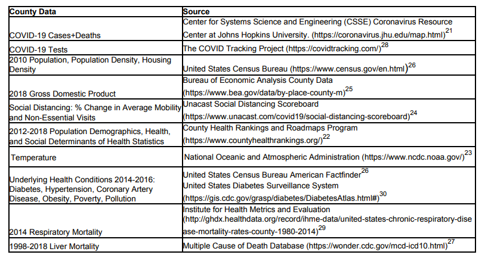

```{r setup, echo=FALSE, cache=FALSE}
  library(knitr)
library(rmdformats)
## Global options
options(max.print="75", scipen = 999, digits = 3, big.mark=",", warn = -1)
opts_chunk$set(echo=FALSE,
	             cache=TRUE,
               prompt=FALSE,
               tidy=TRUE,
               comment=NA,
               message=FALSE,
               warning=FALSE)
opts_knit$set(width=75)
```

```{r basicfunct, include=FALSE}
loadPkg = function(x) { if (!require(x,character.only=T, quietly =T)) { install.packages(x,dep=T,repos="http://cran.us.r-project.org"); if(!require(x,character.only=T)) stop("Package not found") } }
```

```{r libraries}
#library(ggplot2)
#require(gridExtra)
#library(kableExtra)
loadPkg("ggplot2")
loadPkg("gridExtra")
loadPkg("kableExtra")
loadPkg("data.table") 
```

```{r xkablesummary}
loadPkg("xtable")
loadPkg("kableExtra")
loadPkg("stringi")

xkabledply = function(modelsmmrytable, title="Table", digits = 4, pos="left", bso="striped", wide=FALSE) { 
  #' Combining base::summary, xtable, and kableExtra, to easily display model summary. 
  #' wrapper for the base::summary function on model objects
  #' Can also use as head for better display
  #' ELo 202004 GWU DATS
  #' version 1.2
  #' @param modelsmmrytable This can be a generic table, a model object such as lm(), or the summary of a model object summary(lm()) 
  #' @param title Title of table. 
  #' @param digits Number of digits to display
  #' @param pos Position of table, c("left","center","right") 
  #' @param bso bootstrap_options = c("basic", "striped", "bordered", "hover", "condensed", "responsive")
  #' @param wide print table in long (FALSE) format or wide (TRUE) format
  #' @return HTML table for display
  #' @examples
  #' library("xtable")
  #' library("kableExtra")
  #' xkabledply( df, title="Table testing", pos="left", bso="hover" )
  #' xkabledply( ISLR::Hitters[1:5,] )
  if (wide) { modelsmmrytable <- t(modelsmmrytable) }
  modelsmmrytable %>%
    xtable() %>% 
    kable(caption = title, digits = digits) %>%
    kable_styling(bootstrap_options = bso, full_width = FALSE, position = pos)
}

xkabledplyhead = function(df, rows=5, title="Head", digits = 4, pos="left", bso="striped") { 
  xkabledply(df[1:rows, ], title, digits, pos, bso, wide=FALSE)
}

xkabledplytail = function(df, rows=5, title="Tail", digits = 4, pos="left", bso="striped") { 
  trows = nrow(df)
  xkabledply(df[ (trows-rows+1) : trows, ], title, digits, pos, bso, wide=FALSE)
}

xkablesummary = function(df, title="Table: Statistics summary.", digits = 4, pos="left", bso="striped") { 
  #' Combining base::summary, xtable, and kableExtra, to easily display numeric variable summary of dataframes. 
  #' ELo 202004 GWU DATS
  #' version 1.2
  #' @param df The dataframe.
  #' @param title Title of table. 
  #' @param digits Number of digits to display
  #' @param pos Position of table, c("left","center","right") 
  #' @param bso bootstrap_options = c("basic", "striped", "bordered", "hover", "condensed", "responsive")
  #' @return The HTML summary table for display, or for knitr to process into other formats 
  #' @examples
  #' xkablesummary( faraway::ozone )
  #' xkablesummary( ISLR::Hitters, title="Five number summary", pos="left", bso="hover"  )
  
  s = summary(df) %>%
    apply( 2, function(x) stringr::str_remove_all(x,c("Min.\\s*:\\s*","1st Qu.\\s*:\\s*","Median\\s*:\\s*","Mean\\s*:\\s*","3rd Qu.\\s*:\\s*","Max.\\s*:\\s*")) ) %>% # replace all leading words
    apply( 2, function(x) stringr::str_trim(x, "right")) # trim trailing spaces left
  
  colnames(s) <- stringr::str_trim(colnames(s))
  
  if ( dim(s)[1] ==6 ) { rownames(s) <- c('Min','Q1','Median','Mean','Q3','Max') 
  } else if ( dim(s)[1] ==7 ) { rownames(s) <- c('Min','Q1','Median','Mean','Q3','Max','NA') }
  
  xkabledply(s, title=title, digits = digits, pos=pos, bso=bso )
}

xkablevif = function(model, title="VIFs of the model", digits = 3, pos="left", bso="striped", wide=TRUE) { 
  #' Combining faraway::vif, xtable, and kableExtra, to easily display numeric summary of VIFs for a model. 
  #' ELo 202004 GWU DATS
  #' version 1.2
  #' @param model The lm or compatible model object.
  #' @param title Title of table. 
  #' @param digits Number of digits to display
  #' @param pos Position of table, c("left","center","right") 
  #' @param bso bootstrap_options = c("basic", "striped", "bordered", "hover", "condensed", "responsive")
  #' @param wide print table in long (FALSE) format or wide (TRUE) format
  #' @return The HTML summary table of the VIFs for a model for display, or for knitr to process into other formats 
  #' @examples
  #' xkablevif( lm(Salary~Hits+RBI, data=ISLR::Hitters), wide=T )
  
  vifs = table( names(model$coefficients)[2:length(model$coefficients)] ) # remove intercept to set column names
  vifs[] = faraway::vif(model) # set the values
  if (wide) { vifs <- t(vifs) }
  xkabledply( vifs, title=title, digits = digits, pos=pos, bso=bso )
}
```

```{r outlierKD2}
# Fix outliers
outlierKD2 <- function(df, var, rm=FALSE) { 
    #' Original outlierKD functino by By Klodian Dhana,
    #' https://www.r-bloggers.com/identify-describe-plot-and-remove-the-outliers-from-the-dataset/
    #' Modified to have third argument for removing outliers instead of interactive prompt, 
    #' and after removing outlier, original df will not be changed. The function returns a new df, 
    #' which can be saved as original df name if desired.
    #' Check outliers, and option to remove them, save as a new dataframe. 
    #' @param df The dataframe.
    #' @param var The variable in the dataframe to be checked for outliers
    #' @param rm Boolean. Whether to remove outliers or not.
    #' @return The dataframe with outliers replaced by NA if rm==TRUE, or df if nothing changed
    #' @examples
    #' outlierKD2(mydf, height, FALSE)
    #' mydf = outlierKD2(mydf, height, TRUE)
    #' mydfnew = outlierKD2(mydf, height, TRUE)
    dt = df # duplicate the dataframe for potential alteration
    var_name <- eval(substitute(var),eval(dt))
    na1 <- sum(is.na(var_name))
    m1 <- mean(var_name, na.rm = T)
    par(mfrow=c(2, 2), oma=c(0,0,3,0))
    boxplot(var_name, main="With outliers")
    hist(var_name, main="With outliers", xlab=NA, ylab=NA)
    outlier <- boxplot.stats(var_name)$out
    mo <- mean(outlier)
    var_name <- ifelse(var_name %in% outlier, NA, var_name)
    boxplot(var_name, main="Without outliers")
    hist(var_name, main="Without outliers", xlab=NA, ylab=NA)
    title("Outlier Check", outer=TRUE)
    na2 <- sum(is.na(var_name))
    cat("Outliers identified:", na2 - na1, "\n")
    cat("Propotion (%) of outliers:", round((na2 - na1) / sum(!is.na(var_name))*100, 1), "\n")
    cat("Mean of the outliers:", round(mo, 2), "\n")
    m2 <- mean(var_name, na.rm = T)
    cat("Mean without removing outliers:", round(m1, 2), "\n")
    cat("Mean if we remove outliers:", round(m2, 2), "\n")
    
    # response <- readline(prompt="Do you want to remove outliers and to replace with NA? [yes/no]: ")
    # if(response == "y" | response == "yes"){
    if(rm){
        dt[as.character(substitute(var))] <- invisible(var_name)
        #assign(as.character(as.list(match.call())$dt), dt, envir = .GlobalEnv)
        cat("Outliers successfully removed", "\n")
        return(invisible(dt))
    } else {
        cat("Nothing changed", "\n")
        return(invisible(df))
    }
}
# sample usage
# mlb2 = outlierKD2(mlb, weight, TRUE) # This will remove weight outliers, replace those values by NA, then save it as a new dataframe mlb2
# mlb = outlierKD2(mlb, weight, TRUE) # This will remove weight outliers, replace those values by NA, then REPLACE the dataframe mlb with the new one.
# outlierKD2(mlb, weight, FALSE) # This will NOT remove weight outliers, but it will show the charts with and without outliers nonetheless. 
# outlierKD2(mlb, weight) # same as above, as the last argument is optional, default = FALSE 
```


# Introduction: 

Team A are the following members: Amal Alqahtani, Jiaxiang Peng, Naureen Elahi, and Xinya Mu. You may find our work over on GitHub.

Novel Coronavirus is a contagious respiratory virus that first started in Wuhan in December 2019. On 2/11/2020, the disease is officially named COVID-19 by the World Health Organization (WHO). To date, the CDC states there are a total of 4,542, 579 cases and 152, 870 deaths in the United States (Cases in U.S, 2020). Many risk factors have been hypothesized to affect the case and death rates from the virus.
We felt that a relevant discussion to have would be What are the most regions with the highest number of deaths? What can we say about patient demographics? Is race considered a significant risk factor for increased COVID-19 incidence in the United States?’ Are there any general trends amongst underlying health conditions? These questions are all suited to Exploratory Data Analysis (EDA), and with these questions in mind, we want to see if we could find data on COVID-19 that would be readily available for us to analyze. Eventually, our question morphed into the following: What are the factors (i.e. patient demographics, social determinants of health, environmental variables, underlying health conditions, country of origin) affecting 
COVID-19 numbers of cases and death rate among different geographical locations in US?

For this project, we used a public dataset called Covid-19 on Github over here: https://github.com/johndurbin93/Covid-19-Dataset 

## What do you know about this dataset

The data looks like the following:

```{r input_data1}
library("readxl")
data <- read_excel("Counties_Dataset.xlsx")
#summary(data)
str(data)
#names(data)[8:] <- c("total_cases","deaths")
cols <- c(1:2, 7:19, 56)
small_df=data[,cols]
names(small_df)[16] <- c("poor_health")
#Disease_data<-data[,c(1,2,7,8,47,50,53,55,60,61,65,71,72)]
#stay_at_home<-data[,c(1,2,5,7,78,79,80,81,82)]
#str(stay_at_home)
#Print out the first 5 and the last 3 rows of the dataframe.**  
#head(data, 5)
#tail(data, 3)

```

The Covid19 dataset has `r ncol(data)` columns and `r nrow(data)` rows/entries, for a total of `r ncol(data)*nrow(data)` individual data points. Out of `r ncol(data)`, we select the following variables to do EDA:

1. Province
2. State
3. State Code
4. Tests
5. Total cases
6. Deaths
7. Population (for demographic %'s)
8. % less than 18 years of age 
9. % 65 and over
10. % Black
11. % American Indian & Alaska Native
12. % Asian
13. % Native Hawaiian/Other Pacific Islander
14. % Hispanic
15. % Non-Hispanic White
16. % Not Proficient in English
17. % Female
18. No Cases	
19. No Stay At Home Order	
20. Stay At Home Order After First Case
21. Percentage Living in Poverty
22. Social Association Rate

47. % Sleep Hour < 7 
48. % Sleep Hour < 7 Confidence Intervial low 
49. % Sleep Hour < 7 Confidence Intervial high
50. % Diabetes Total Percentage 
51. % Diabetes Total Male Percentage
52. % Diabetes Total Female Percentage
53. Coronary Heart Death Rate per 100,000 people  
54. Hyperten slon Death Rate per 100,000 people  
55. % Obesity Age adjuseted 
56. % Fair or Poor Heath
57. Average number of Physically Unhealthy Days 
58. Average number of Mentally Unhealthy Days
59. % Low Birthweight 
60. % Smokers 
61. % Adults with Obesity
62. Food Environment Index 
63. % Physically Inactive 
64. % With Access to Exercise Opportunities 
65. % Excessive Drinking 
66. % Unisured
67. Preventable Hospitalization Rate
68. % With Annual Mammogram
69. % Flu Vaccinated 
70. Chronic Respiratory Disease per 100,000 people
71. Liver Disease: crude mortality per 100,000 people
72. Liver Disease: % of Total death

To prepare our data for EDA we clean the dataset and remove all NAs. 
```{r remove_NAs}
#Print the number of NA values per each columns 
#colSums(is.na(data))
#Which col contains NA values? 
#colnames(data)[!complete.cases(t(data))]

#Drops rows containing missing values in any variable:
data_noNA = na.omit(small_df)
# str(data_noNA)
```

## How it was gathered?

This data set was collected using publicly available data sources (Li et al., 2020). It includes COVID-19 confirmed case and death numbers through April 14, 2020  which were obtained for each U.S. county from the Center for Systems Science and Engineering (CSSE) Coronavirus Resource Center at Johns Hopkins University. Race demographics for counties was obtained from the County Health Rankings and Roadmaps Program database. Daily temperature data for counties was obtained from the National Oceanic and Atmospheric Administration. County temperature was calculated using mean temperature for a period starting 10 days before the first confirmed county case and through the most current date (April 14, 2020). Unacast social distancing data was obtained through a research agreement with the company (Li et al., 2020). The following table shows the sources for each factor (Li et al., 2020).  

```{r pressure, echo=FALSE, fig.cap="Information of data", out.width = '100%'}

``` 


## What are the limitations of the dataset?

There are many limitations to this data set. In fact, this data set does not represent the entire States of the US since it only includes the counties with sufficient data. Hence, many counties were excluded from the analysis for lack of COVID-19 cases or lack of COVID-19 deaths. Another limitation is that the COVID-19 pandemic is still ongoing and the last date that the data set was collected was April 14, 2020. This means that the data of all included counties in this data set is at different stages which may not reflect the ultimate case and death tolls in these counties. 


## What analysis has already been completed related to the content in your dataset? 

COVID-19 still remains a mystery and since the virus is still relatively recent and foreign, we were expecting there to be multiple data analyses to better understand and monitor the virus. Looking online, we found various research studies related to the virus. In the Journal of Medical Sciences, there was a multivariate analysis study that compared risk factors to COVID-19 case and death rates while accounting for confounding factors. This group stated that there are risk factors that are hypothesized to have an effect on COVID-19 case and death rates, which includes underlying health conditions, adherence to social distancing protocols, social determinants of health, and patient demographics. This study focused on U.S counties, which was similar to our data set. From their study, they concluded that race, specifically Black, was a risk factor for increased COVID-19 case and death rates independent of other factors, such as poverty level or access to health care. Temperature was also shown to have an effect on total cases, but not death rate. Areas with higher average daily temperature showed a decrease in the total number of COVID-19 cases. (Li et al., 2020). In addition, the CDC conducted surveillance and investigations on why some people are more likely to develop the disease than others. The potential risk factors CDC noted are race/ethnicity, gender, medical conditions, poverty and crowding, occupation, and pregnancy. (Assessing Risk Factors for Severe COVID-19 Illness, nd). 

## How did the research you gathered contribute to your question development?

Our group was interested in looking further into data related to COVID-19 because it was a very timely and relevant topic as we are living in this new normal. Before researching what data sets were out there, we brainstormed possible COVID-19 topics we could begin to delve in. A few of those topics discussed were hospital utilization during COVID-19, policy, and testing. We each found data sets that could be best related to the topics we have discussed and chose the one that best fit the requirements for our project.

After reviewing our chosen data set and having background knowledge that there are factors that impact the death rate and total cases cases, we chose our ultimate SMART question, “What are factors that lead to an increase in COVID-19 cases and death rates?” After learning more about the virus and potential factors, we understood that risk factors like health conditions, race, age, adherence to policies, and etc. could have an impact on the total cases of COVID-19. Our question also originally derived from pure curiosity, since we did have knowledge on the virus beforehand. We wanted to find the answers to our SMART question ourselves from our own data analysis. However, with the information that we did know, we came up with sub-questions, which will be further discussed later on, to help determine our final SMART question and make sure our final question was able to be determined through the variables in our data set. 

## What additional information would have been beneficial? 

Additional information in our data set could have been beneficial to aid our analysis. For example, it would have been helpful to have testing information for each city and not by state as in the data set. This variable was not consistent with the rest of the data collection in the set. It also would have been beneficial to have ongoing data, rather than it ending in April to have the most updated data. Since scientists are finding new information on COVID-19 as time goes on, our results could have been more relevant or have more significance to the situation if we had more recent data because the results may have shown different conclusions. It also may have been more helpful to have information on what each variable specifically is in the data set, such as in a guide, to prevent any guess work. 

# EDA Part
## How did your question change, if at all, after EDA?

In the beginning we asked a few questions, such as “Which race is the majority of the sample?" and "Are patient from a certain race?” In the EDA study, we deleted the last sentence because this is an overall study on the COVID-19 epidemic in different regions of the United States, not a study on the individual participant. We just cannot determine the race of each confirmed individual.

We also deleted the question “which race has the most average death rate and total cases?”. The reason is the same as above, because we cannot determine the situation of each individual and cannot make statistics analysis on this problem. We can only observe the correlation coefficients between total cases, death and different proportion of races based on the correlation coefficient graph. Therefore, we changed the question to “The proportion of which race is related to the number of confirmed cases and deaths?”.

In addition, we added a few more questions, "Are the total cases related to age/gender/Poverty?". To answer these questions, we first divided total cases into four levels, and then found that the average values of these variables at different levels are significantly different. Thus, we determined those variables are related to total cases. 

We also set another question at the beginning of our analysis, "Are there any general trends among the health conditions?". Studies have shown that the correlation coefficient between health (such as sleep status, medical history of various diseases, smoking, obesity, etc.) and death is not large. Only the correlation coefficient between liver_total_death and death is relatively high.

Finally, we deleted the question "Are there any common underlying health conditions?" and changed it to "Does any disease relate to the death rate?".

## Based on EDA can you begin to sketch out an answer to your question?

### United States COVID-19 Cases and Deaths by Provinces (Cities)


#### What are the top 15 Provinces based on the number of cases?

The following bar chart shows the top 15 cities by number of Covid-19 cases. 

```{r top_10_cases, echo=F}
 library(ggplot2)
 library(dplyr)
  top_n(data_noNA, n=15, total_cases) %>%
          ggplot(., aes(x=reorder(Province, -total_cases), y=total_cases, color=Province, fill=Province)) +
  geom_bar(aes(y=total_cases), stat="identity") + 
  theme_minimal() + 
  theme(axis.text.x = element_text(angle = 90, vjust = 1, size = 12, hjust = 1), 
        axis.text.y = element_text(vjust = 1, size = 12, hjust = 1), 
        panel.border = element_rect(colour = "black", fill=NA, size=1)) + 
  labs(title="Barchart of Top 15 Provinces (determined by number of Cases)", x="Province", y="Number of Cases")   
  
```

The above Bar chart shows the top 15 provinces determined by the number of cases. New York province is highest city with number of Covid-19 cases, the total number is over 100000, while the number of cases in other cities  is less than 30000. 


#### What are the top 15 Provinces based on the number of deaths?

The following bar chart shows the top 15 cities by number of deaths. 

```{r top_15_deaths, echo=F}
 library(ggplot2)
 library(dplyr)
  top_n(data_noNA, n=15, deaths) %>%
          ggplot(., aes(x=reorder(Province, -deaths), y=deaths, color=Province, fill=Province)) +
  geom_bar(aes(y=deaths), stat="identity") + 
  theme_minimal() + 
  theme(axis.text.x = element_text(angle = 90, vjust = 1, size = 12, hjust = 1), 
        axis.text.y = element_text(vjust = 1, size = 12, hjust = 1), 
        panel.border = element_rect(colour = "black", fill=NA, size=1)) + 
  labs(title="Barchart of Top 15 Provinces (determined by number of Deaths)", x="Province", y="Number of Deaths")   
  
```

The above Bar chart shows the top 15 provinces determined by the number of deaths. New York province is the highest city with number of deaths around 8000, while the number of deaths in other cities  is less than 1000. 


#### What are the top 15 States based on the number of Tests?

```{r testsPerState, echo=F}
testsPerState=distinct(data, State, Tests)
```
```{r top_10_test, echo=F}
 library(ggplot2)
 library(dplyr)
    top_n(testsPerState, n=15, Tests) %>%
          ggplot(., aes(x=reorder(State, -Tests), y=Tests, color=State, fill=State)) +
  geom_bar(aes(y=Tests), stat="identity") + 
  theme_minimal() + 
  theme(axis.text.x = element_text(angle = 90, vjust = 1, size = 12, hjust = 1), 
        axis.text.y = element_text(vjust = 1, size = 12, hjust = 1), 
        panel.border = element_rect(colour = "black", fill=NA, size=1)) + 
  labs(title="Barchart of Top 15 States (determined by number of Tests)", x="State", y="Number of Tests")   
  
```

The above Bar chart shows the top 15 States determined by the number of tests. It can be clearly seen that the number of tests has been done in New York State is around 499,143 tests which is considered to be the highest among the other states. Furthermore, the number of test has been done in other states is less than 200k.


#### What is the average cases for each State?

```{r rop avg cases, echo=F}
print(aggregate(total_cases~State,data=data_noNA,FUN=mean))
```
#### What is the average deaths for each State?

```{r rop avg deaths, echo=F}
print(aggregate(deaths~State,data=data_noNA,FUN=mean))
```


#### Which cities had the greatest % of population of people with poor health?

```{r poorhealth, echo=F}
loadPkg("dplyr")
data_noNAinpoorhealth = subset(data_noNA, poor_health != "NA")[,c(1,16)]
data_noNAinpoorhealth$poor_health=as.numeric(data_noNAinpoorhealth$poor_health)
#head(data_noNAinpoorhealth)
a=arrange(data_noNAinpoorhealth, desc(poor_health))
#head(a,10)
``` 

```{r cities_poor_health, echo=F}
 library(ggplot2)
 library(dplyr)
    top_n(data_noNAinpoorhealth, n=15, poor_health) %>%
          ggplot(., aes(x=reorder(Province, -poor_health), y=poor_health, color=Province, fill=Province)) +
  geom_bar(aes(y=poor_health), stat="identity") + 
  theme_minimal() + 
  theme(axis.text.x = element_text(angle = 90, vjust = 1, size = 12, hjust = 1), 
        axis.text.y = element_text(vjust = 1, size = 12, hjust = 1), 
        panel.border = element_rect(colour = "black", fill=NA, size=1)) + 
  labs(title="Barchart of the top 15 cities had the greatest % of population of people with poor health", x="Province", y="Poor_health")   
  
```


### Patient Demographics
#### What are the patient demographics?
```{r}
getwd()
df=data.frame(read.csv("V1.csv", header = TRUE))[,-c(25,26,27,28,29,30,31,32,33)]
#str(df)
colnames(df) <- c("TC","death","Population","young","old","black","AIAN","Asian","NH","Hispanic","NHW","Female","Rural","Population.Density","Housing.Density","Sunlight","GDP","Poverty","Unemployed","Children.Poverty","Income.Inequality","Social","PM2.5","Water","SHP")
df$Water=as.factor(df$Water)
df$Poverty=as.numeric(df$Poverty)
#str(df)

loadPkg("DMwR")
df2=centralImputation(df) #Fill in missing values
# sum(is.na(df2)) #Now there are no missing values

xkablesummary(df2[,c(1,3,4,5,6,7,8,9,10,11,12,18,22)])
```

From the average of the output results, we can see that the average proportion of teenagers under the age of 18 is 22.1%, and the average proportion of people over 65 is 19.3%. The largest number of all races is Non-Hispanic White, with an average proportion of 76.2. The average proportion of women is 49.9, the average proportion of the poor is 15.9%, and the average of the Social Association Rate is 11.6.
We divide the data into four levels according to total cases.

#### Which race is the majority of the sample?
```{r}
racemean = data.frame(Race.ratio= c(8.8,2.4,1.5,0.1,9.6,76.2), legend= c('Black','American Indian & Alaska Native','Asian','Native Hawaiian/Other Pacific Islander','Hispanic','Non-Hispanic White'))
p = ggplot(racemean, aes(x = "", y =Race.ratio, fill =legend)) + 
  geom_bar(stat = "identity", width = 1) +  
  coord_polar(theta = "y")   
p
```
According to the average value, we get a pie chart of race proportions, from which we can see the overall proportions of different races.

### Stay at home policy in each province
#### Is the stay at home policy related to the Total Cases infected?
First, we do the t-test and find the 80% and 99% confidence interval.
```{r,t-test,echo=F}
loadPkg("dplyr") 
#remove the outlier for total_cases
stay_at_home<-data[,c(1,2,5,7,78,79,80,81,82)]
names(stay_at_home)[5:9] <- c("first_case","stay_home","no_case","no_order","order_after_first")
stay_at_home$first_case<-as.factor(stay_at_home$first_case)
#bike$Season<-as.factor(bike$Season)
#colnames(stay_at_home)[8,9]=c("no_order","order_after_first")
#stay_at_home<-subset(stay_at_home,is.na(total_cases))
nrow(stay_at_home)
#str(stay_at_home)
#stay_at_home<-stay_at_home %>% subset(total_cases>0)
#nrow(stay_at_home)
#stay_at_home
stay_at_home = outlierKD2(stay_at_home, total_cases, TRUE)
nrow(stay_at_home)
Before_order <- subset(stay_at_home,no_order==1)
After_order  <- subset(stay_at_home,order_after_first==1)
Before_ttest80 = t.test(x = Before_order$total_cases, conf.level = 0.80)
Before_ttest80
After_ttest80 = t.test(x = After_order$total_cases, conf.level = 0.80)
After_ttest80
Before_ttest99 = t.test(x = Before_order$total_cases, conf.level = 0.99)
Before_ttest99
After_ttest99 = t.test(x = After_order$total_cases, conf.level = 0.99)
After_ttest99
```
Before first case have stay at home order 80% & 99% confidence interval does not overlap with after first case have stay at home order. As a result, the average Total Cases infected number is different from separate groups that the Stay at Home Policy is order before the First Case or not.

#### Is the stay at home policy after the first case related to the people inflected number?
```{r,box_plot,echo=F}
ggplot(data = Before_order, aes(x=first_case, y=total_cases))+
  geom_boxplot(fill = "#0000aa", alpha = .7)+
  labs(title="Total Cases Boxplot for Before the  First Case Stay at Home") +
  labs(x="First Cases", y="Total Cases") 
ggplot(data = After_order, aes(x=first_case, y=total_cases))+
  geom_boxplot(fill="#FF9933", alpha = .7)+
  labs(title="Total Cases Boxplot for After the First Case Stay at Home") +
  labs(x="First Cases", y="Total Cases") 
#str(stay_at_home)
```

For these two box-plot diagrams, the Total Cases infected are higher if the Stay at Home Policy is ordered After the first cases. Thus, we can say the Stay at Home Policy do decrease the Total Cases inflected if it is ordered before the First Case occurred. 


### Underlying Health Conditions

#### Does any disease relate to the death rate?

```{r,disease,echo=F}
loadPkg("dplyr") 
loadPkg("corrplot")
#str(disease)
disease<-data[,c(1,2,7,8,47,50,53,55,60,61,65,71,72)]
names(disease)[5:13] <- c("sleep_hour","diabetes","heart_disease","obesity_age","smokers",
"adult_obesity","excessive_drink","liver_crude_mortality","liver_Total_death","")
disease2<-disease[ , -which(colnames(disease) %in% c("Province","State","total_cases"))]

disease2$sleep_hour<-as.numeric(as.character(disease2$sleep_hour))
disease2$smokers<-as.numeric(as.character(disease2$smokers))
disease2$adult_obesity<-as.numeric(as.character(disease2$adult_obesity))
disease2$excessive_drink<-as.numeric(as.character(disease2$excessive_drink))
disease2$liver_crude_mortality<-as.numeric(as.character(disease2$liver_crude_mortality))
disease2$liver_Total_death<-as.numeric(as.character(disease2$liver_Total_death))
disease2=disease2 %>% subset(deaths>0)
#disease2=disease2 %>% subset(total_cases>0)
disease2=disease2 %>% subset(heart_disease>0)
disease2=disease2 %>% subset(obesity_age>0)
disease2=disease2 %>% subset(smokers>0)
disease2=disease2 %>% subset(diabetes>0)
disease2=disease2 %>% subset(sleep_hour>0)
disease2=disease2 %>% subset(adult_obesity>0)
disease2=disease2 %>% subset(excessive_drink>0)
disease2=disease2 %>% subset(liver_crude_mortality>0)
disease2=disease2 %>% subset(liver_Total_death>0)
disease2_corr<-cor(disease2)
#str(disease2)
corrplot(disease2_corr,method="circle")
#corrplot.mixed(cor(disease2))
#corrplot.mixed(cor(race))
```


This shows liver_total_death is highly correlated to deaths at correlation = 0.4338.

### Impact of Temperature

#### Does the temperature relate the Total Cases or Death Rate? 

```{r,temperature,echo=F}
temp<-data[,c(1,2,6,7,8,75,76,77)]
names(temp)[3] <- c("days")
names(temp)[6:8] <- c("temp_peak","temp_before","temp_current")
str(temp)
#ggplot(data=temp)+
#  geom_point(mapping = aes(x=temp_peak, y=total_cases, color=State))+
#  ggtitle("Scatter plot of baseball player weigth(y, lbs) vs height(x, inches)")
temp2<-temp[ , -which(colnames(temp) %in% c("Province","State"))]
#temp2$liver_Total_death<-as.numeric(as.character(disease2$liver_Total_death))
temp2=temp2 %>% subset(deaths>0)
temp2=temp2 %>% subset(days>0)
temp2=temp2 %>% subset(total_cases>0)
temp2=temp2 %>% subset(temp_peak>0)
temp2=temp2 %>% subset(temp_before>0)
temp2=temp2 %>% subset(temp_current>0)
temp2_corr<-cor(temp2)
#str(disease2)
loadPkg("corrplot")
corrplot(temp2_corr,method="circle")
```

According to the correlation diagram, the temperature is less relate to total_cases and deaths. 

```{r}
#sum(is.na(df2$TC))
break1=fivenum(df2$TC)
break1
labels = c("0-2", "2-9", "9-39", "39-110465")
rank=cut(df2$TC,break1,labels,ordered_result = T)

```

### The proportion of which race is related to the number of confirmed cases and deaths
```{r}
race=subset(df2[,c(1,2,6,7,8,9,10,11)])
loadPkg("corrplot")
corrplot.mixed(cor(race))
```


The results show that the positive correlation coefficient between Asians and total cases is the largest, which is 0.19, indicating that there are more total cases where the proportion of Asians is high. Followed by Hispanics and blacks, but the correlation coefficients are very small. The correlation coefficient between non-Hispanic whites and TC is -0.1. the relationship between the number of deaths and race, and the results are consistent with the above results.

### Are the total cases related to age?
#### Are the total cases related to the proportion of people over 65?
```{r boxplot old, echo=FALSE}
loadPkg("plotly")
ggplotly(ggplotly(ggplot(df2, aes(x=rank, y=old, fill=rank)) + geom_boxplot() + scale_fill_brewer(palette="Spectral") + ggtitle("Proportion of elderly over 65 vs. Total cases") + ylab("Proportion of elderly over 65") + xlab("Total cases") +  theme(plot.title= element_text(hjust=0.5, size = 14))))
```


It can be seen from the image that the proportion of elderly people is lower in areas with more total cases.

```{r old test}
loadPkg('lmtest')
test1 <- bptest(df2$old~rank)
test1$p.value

old.anova <- aov(df2$old~rank)
summary(old.anova)
TKcond <- TukeyHSD(old.anova)
TKcond

par(las=1)
plot(TukeyHSD(old.anova))
```

It shows that the proportion of elderly people over 65 years old is different in regions with different confirmed cases. The elderly have few outdoor activities and tend to live in large and sparsely populated areas, which is not conducive to the spread of the virus. Therefore, the epidemic situation is not serious in places with a high proportion of elderly people.

#### Are the total cases related to the proportion of young people under 18?

```{r boxplot young, echo=FALSE}
ggplotly(ggplotly(ggplot(df2, aes(x=rank, y=young, fill=rank)) + geom_boxplot() + scale_fill_brewer(palette="Spectral") + ggtitle("proportion of youth under 18 vs. Total cases") + ylab("proportion of youth under 18") + xlab("Total cases") +  theme(plot.title= element_text(hjust=0.5, size = 14))))
```

It is difficult to determine whether the two variable are related from the figure.

```{r young bptest,echo=F}
test2 <- bptest(df2$young~rank)
test2$p.value
```

```{r young chitest}
break2=fivenum(df2$young)
break2
labels = c("0-20.1", "20.1-22.1", "22.1-23.8", "23.8-42.0")
youncate=cut(df2$young,break2,labels,ordered_result = T)

young_p <- table(rank, youncate)
x2test1 = chisq.test(young_p)
x2test1

```
The test indicates that there is a relationship between the two variables. The percentage of people under 18 will affect the total cases.

### Are the total cases related to gender?
```{r}
ggplotly(ggplotly(ggplot(df2, aes(x=rank, y=Female, fill=rank)) + geom_boxplot() + scale_fill_brewer(palette="Spectral") + ggtitle("Female vs. Total cases") + ylab("Proportion of female") + xlab("Total cases") +  theme(plot.title= element_text(hjust=0.5, size = 14))))
```

In areas with more total cases, the average percentage of women is higher.
```{r gender bptest}
test3 <- bptest(df2$Female~rank)
test3$p.value
```

```{r gender chitest}
break3=fivenum(df2$Female)
break3
labels = c("26.8-49.4", "49.4-50.3", "50.3-51.0", "51.0-56.9")
femalecate=cut(df2$Female,break3,labels,ordered_result = T)

female_p <- table(rank, femalecate)
x2test2 = chisq.test(female_p)
x2test2

```

From the results of the test, the proportion of female is related to total cases.

### Are the total cases related to Poverty?
```{r}
ggplotly(ggplotly(ggplot(df2, aes(x=rank, y=Poverty, fill=rank)) + geom_boxplot() + scale_fill_brewer(palette="Spectral") + ggtitle("Poverty vs. Total cases") + ylab("Proportion of Poverty") + xlab("Total cases") +  theme(plot.title= element_text(hjust=0.5, size = 14))))
```

From the first to the third level, the more total cases, the larger the average proportion of poor people. The average proportion of poor people in severely affected areas is the lowest.

```{r Poverty bptest}
test4 <- bptest(df2$Poverty~rank)
test4$p.value


Poverty.anova <- aov(df2$Poverty~rank)
summary(Poverty.anova)
TKcond <- TukeyHSD(Poverty.anova)
TKcond

par(las=1)
plot(TukeyHSD(Poverty.anova))
```


Places with a larger proportion of poor people have more TC. However, in regions with the most TC, the proportion of poor groups is the lowest. According to the previous research, we know that New York City is the place where the epidemic is the worst in the US. It may be because the prosperous cities are densely populated and the epidemic is serious, but the proportion of poor people in prosperous cities is not high.

# Models
## How did you select and determine the correct model to answer your question?

Below is how we selected and determined the correct model to answer the question. 

### Linear model
```{r}
getwd()
lineardf<-data[,c(1,2,7,8,9,10,11,12,13,14,15,16,17,19,20,21,22,23,24,26,33,34,35,37,39,41,47, 50,53,55,56,58,60,61,65,71,72)]
colnames(lineardf) <- c("Province","State","TC","deaths","population","young","old","black","AIAN","Asian","NH","Hispanic","NHW","Female","Rural","Population.Density","Housing.Density","Sunlight","GDP","Poverty","Unemployed","Children.Poverty","Income.Inequality","Social","PM2.5","SHP","sleep_hour","diabetes","heart_disease","obesity_age", "poorhealth","Unhealthy.Days","smokers","adult_obesity","excessive_drink","liver_crude_mortality","liver_Total_death")
#str(lineardf)
lineardf2=as.data.frame(lapply(lineardf,as.numeric))
#lineardf2$Water=as.factor(lineardf2$Water)
# subset(lassodf, TC != "NA")
lineardf3=na.omit(lineardf2[,-c(1,2,3)])
#str(lineardf3)

```

```{r,q10__,echo=F}
loadPkg("leaps")
reg.leaps1 <- regsubsets(deaths~., data = lineardf3, nbest = 1, method = "exhaustive")  # leaps, 
plot(reg.leaps1, scale = "bic", main = "BIC")
plot(reg.leaps1, scale = "adjr2", main = "Adjusted R^2")

lm.whole1<-lm(deaths~Population.Density+GDP+SHP+sleep_hour+poorhealth,data = lineardf3)
summary(lm.whole1)
faraway::vif(lm.whole1)

```

We use the regsubsets function, exhaustive method, to find the best model from two perspectives: BIC and adjusted R-squared. Both methods point to the same model, which contains five variables: Population Density per Square mile of Land, GDP (2018),% Severe Housing Problems, Sleep <7 Hours_Percent,% Fair or Poor Health. From the p-value, these five variables are all significant. VIF shows that these five variables have no high degree of autocorrelation and can be left in the model. The adjusted r-squared is 0.236, indicating that the model explained 23.6% of the variation in death.

Final model:
death=-41.185+0.002 Population.Density + 0.0000006479 GDP + 1.051 SHP +1.509 sleep_hour + -1.230 poorhealth


### LASSO Regression

Because there are many variables, Lasso regression is chosen to fit the best model. Lasso regression can change the coefficients of many variables to 0, which plays a role in variable selection.
```{r}
getwd()
lassodf=data.frame(read.csv("V1.csv", header = TRUE))[,-2]

colnames(lassodf) <- c("TC","population","young","old","black","AIAN","Asian","NH","Hispanic","NHW","Female","Rural","Population.Density","Housing.Density","Sunlight","GDP","Poverty","Unemployed","Children.Poverty","Income.Inequality","Social","PM2.5","Water","SHP","poorhealth","Unhealthy.Days","smokers","Obesity","Physically.ina","WAEO","CRD","Temp","Order")


lassodf$Poverty=as.numeric(lassodf$Poverty)
lassodf$Water=as.factor(lassodf$Water)
lassodf$Order=as.factor(lassodf$Order)
#str(lassodf)

# subset(lassodf, TC != "NA")
lassodf=na.omit(lassodf)

```

```{r uzscale_fcn}
uzscale <- function(df, append=0, excl=NULL) { 
  #' Standardize dataframe to z scores, safe for non-numeric variables. 
  #' ELo 201904 GWU DATS
  #' @param df The dataframe.
  #' @param append T/F or 0/1. Option to append scaled columns or replace original columns in the dataframe.
  #' @param excl A list c(a,b,"d","ef") of excluded columns, either by their indexes and/or names.
  #' @return The transformed dataframe, appended or replaced with standardized scores. Non-numeric columns will not be appended, or if "replace option" is chosen, the columns will be untouched.
  #' @examples
  #' library("ISLR")
  #' tmp = uzscale( Hitters )
  #' tmp = uzscale( Hitters, 1 )
  #' tmp = uzscale( Hitters, TRUE, c(19,"NewLeague") )
  
  append = ifelse(append==TRUE || append=="true" || append=="True" || append=="T" || append=="t" || append==1 || append=="1", TRUE, FALSE) # standardize append 
  nmax = length(df)
  if (nmax < 1 || !is.numeric(nmax) ) { return(df) }
  df1 = df
  onames = colnames(df)  # the original column names
  cnames = onames  # the new column names, if needed start with the original ones
  znames = paste("z",cnames, sep="")     # new column names added prefix 'z'. Those are non-numeric will not be used.
  nadd = ifelse(append, nmax, 0) # add to the column index or replace the orig columns
  j=1  # counting index
  for( i in 1:nmax ) {
    if ( is.numeric(df[,i]) && !( i %in% excl || onames[i] %in% excl ) ) { 
      df1[,j+nadd] = scale(df[,i])
      cnames = c(cnames, znames[i])
      j=j+1
    } else if ( !append ) { j=j+1
    } # if append == 1 and (colunm non-numeric or excluded), do not advance j.
  }
  if (append) { colnames(df1) <- cnames }
  return(df1)
}
```

```{r sd&split}
stdf=uzscale(lassodf, 0)

x=model.matrix(TC~.,stdf)[,-1]
y=stdf$TC

loadPkg("glmnet")
grid=10^seq(5,-5,length=100) # prepare log scale grid for λ values, from 10^10 to 10^-2, in 100 segments

loadPkg("dplyr")
set.seed(1)
train = stdf %>% sample_frac(0.5)
test = stdf %>% setdiff(train)

x_train = model.matrix(TC~., train)[,-1]
x_test = model.matrix(TC~., test)[,-1]

y_train = train %>% select(TC) %>% unlist() # %>% as.numeric()
y_test = test %>% select(TC) %>% unlist() # %>% as.numeric()
```

```{r lassomodel}
lasso.mod=glmnet(x_train,y_train,alpha=1,lambda=grid)
plot(lasso.mod)
set.seed(1)
cv.out.lasso=cv.glmnet(x_train,y_train,alpha=1)
plot(cv.out.lasso)
```

```{r}
bestlam.lasso=cv.out.lasso$lambda.min
cat("lowest lamda from CV: ", bestlam.lasso, "\n\n")
```

We see that the lowest MSE is when $\lambda$ appro = `r round(bestlam.lasso,digits=6)`. 

```{r}
lasso.pred=predict(lasso.mod,s=bestlam.lasso,newx=x_test)
#
out.lasso = glmnet(x, y, alpha = 1, lambda = grid) # Fit lasso model on full dataset
lassoMeanMse = mean((lasso.pred-y_test)^2)
cat("Mean MSE for best Lasso lamda: ", lassoMeanMse, "\n\n")
#
lasso_coef = predict(out.lasso, type = "coefficients", s = bestlam.lasso)[1:13,] # Display coefficients using λ chosen by CV
cat("\nAll the coefficients : \n")
lasso_coef
cat("\nThe non-zero coefficients : \n")
lasso_coef[lasso_coef!=0]
```
From LASSO regression, the coefficients of 11 variables are not zero, the coefficients of the remaining variables become zero. From the results, we can see that race, gender, age, population, population density and rural proportions will all have an impact on total cases.

```{r lasso R2, echo=FALSE}
sst1 <- sum((y_test - mean(y_test))^2)
sse1 <- sum((lasso.pred - y_test)^2)
rsq1 <- 1 - sse1 / sst1
```

We then calculate the R squared of lasso regression, which is `r rsq1`.  

## What prediction can you make with your model?

```{r,disease3,echo=F}
loadPkg("corrplot")
disease4<-data[,c(1,2,7,8,47,48,49,50,51,52,53,54,55,56,57,58,59,60,61,62,63,64,65,66,67,68,69,70,71,72)]
names(disease4)[5:30] <- c("sleep_hour","sleep_hour_low","sleep_hour_high","diabetes","diabetes_male","diabetes_female","heart_disease","Hypertension","obesity_age","Poor_health","Physical_Unhealthy","Mentally_unhealthy","Low_birthweight","smokers","adult_obesity","Food_environment","Physically_inactive","Exercise_opportunity","excessive_drink","Uninsured","Preventable_Hospital","Mammogram","Flu_vaccinated","Respiratory","liver_crude_mortality","liver_Total_death")
#disease<-data[,c(1,2,7,8,47,50,53,55,60,61,65,71,72)]
disease3<-disease4[ , -which(colnames(disease4) %in% c("Province","total_cases"))]
disease3$sleep_hour<-as.numeric(as.character(disease3$sleep_hour))
disease3$sleep_hour_low<-as.numeric(as.character(disease3$sleep_hour_low))
disease3$sleep_hour_high<-as.numeric(as.character(disease3$sleep_hour_high))
disease3$diabetes<-as.numeric(as.character(disease3$diabetes))
disease3$diabetes_male<-as.numeric(as.character(disease3$diabetes_male))
disease3$diabetes_female<-as.numeric(as.character(disease3$diabetes_female))
disease3$heart_disease<-as.numeric(as.character(disease3$heart_disease))
disease3$Hypertension<-as.numeric(as.character(disease3$Hypertension))
disease3$obesity_age<-as.numeric(as.character(disease3$obesity_age))
disease3$Poor_health<-as.numeric(as.character(disease3$Poor_health))
disease3$Physical_Unhealthy<-as.numeric(as.character(disease3$Physical_Unhealthy))
disease3$Mentally_unhealthy<-as.numeric(as.character(disease3$Mentally_unhealthy))
disease3$Low_birthweight<-as.numeric(as.character(disease3$Low_birthweight))
disease3$smokers<-as.numeric(as.character(disease3$smokers))
disease3$adult_obesity<-as.numeric(as.character(disease3$adult_obesity))
disease3$Food_environment<-as.numeric(as.character(disease3$Food_environment))
disease3$Physically_inactive<-as.numeric(as.character(disease3$Physically_inactive))
disease3$Exercise_opportunity<-as.numeric(as.character(disease3$Exercise_opportunity))
disease3$excessive_drink<-as.numeric(as.character(disease3$excessive_drink))
disease3$Uninsured<-as.numeric(as.character(disease3$Uninsured))
disease3$Preventable_Hospital<-as.numeric(as.character(disease3$Preventable_Hospital))
disease3$Mammogram<-as.numeric(as.character(disease3$Mammogram))
disease3$Flu_vaccinated<-as.numeric(as.character(disease3$Flu_vaccinated))
disease3$Respiratory<-as.numeric(as.character(disease3$Respiratory))
disease3$liver_crude_mortality<-as.numeric(as.character(disease3$liver_crude_mortality))
disease3$liver_Total_death<-as.numeric(as.character(disease3$liver_Total_death))
disease3=disease3 %>% subset(deaths>0)
disease3=disease3 %>% subset(sleep_hour_low>0)
disease3=disease3 %>% subset(sleep_hour_high>0)
disease3=disease3 %>% subset(Low_birthweight>0)
disease3=disease3 %>% subset(Food_environment>0)
#disease3=disease3 %>% subset(deaths>0)
#disease2=disease2 %>% subset(total_cases>0)
disease3=disease3 %>% subset(heart_disease>0)
disease3=disease3 %>% subset(obesity_age>0)
disease3=disease3 %>% subset(smokers>0)
disease3=disease3 %>% subset(diabetes>0)
disease3=disease3 %>% subset(sleep_hour>0)
disease3=disease3 %>% subset(adult_obesity>0)
disease3=disease3 %>% subset(excessive_drink>0)
disease3=disease3 %>% subset(liver_crude_mortality>0)
disease3=disease3 %>% subset(liver_Total_death>0)
disease5<-disease3[ , -which(colnames(disease3) %in% c("State"))]
disease5_corr<-cor(disease5)
#str(disease2)
corrplot(disease5_corr, method="circle")
```

For the tempreture part: 
```{r,temperature1,echo=F}
temp<-data[,c(1,2,6,7,8,75,76,77)]
names(temp)[3] <- c("days")
names(temp)[6:8] <- c("temp_peak","temp_before","temp_current")
str(temp)
temp2<-temp[ , -which(colnames(temp) %in% c("Province","State"))]
temp2<-temp[ , -which(colnames(temp) %in% c("Province","State"))]
temp2=temp2 %>% subset(deaths>0)
temp2=temp2 %>% subset(days>0)
temp2=temp2 %>% subset(total_cases>0)
temp2=temp2 %>% subset(temp_peak>0)
temp2=temp2 %>% subset(temp_before>0)
temp2=temp2 %>% subset(temp_current>0)
temp2_corr<-cor(temp2)
corrplot(temp2_corr,method="circle")
corrplot.mixed(cor(temp2))
```
According to the correlation diagram, the temperature is less related to total_cases and deaths. However, it does relate to the variable, days. This means the higher the temperature in the city, the later the disease occurs in this city. For prediction, the second peak is coming as earlier as the weather turns from summer to winter which means the temperature goes down. As the temperature becomes colder, the second peak of the spread comes earlier. 


## How reliable are your results?

```{r}
loadPkg("pls")
loadPkg("mice")
loadPkg("ISLR")
#Again we want to scale our data and "CV" stands for cross validation, which is defaulted to RMSE, using Hitters Data Set in the ISLR package 
#Hitters2 <- disease5[,c("Salary","AtBat","Hits","HmRun","Runs","RBI","Walks","Assists","Errors")]
disease3<-disease4[ , -which(colnames(disease4) %in% c("Province"))]
disease3$sleep_hour<-as.numeric(as.character(disease3$sleep_hour))
disease3$sleep_hour_low<-as.numeric(as.character(disease3$sleep_hour_low))
disease3$sleep_hour_high<-as.numeric(as.character(disease3$sleep_hour_high))
disease3$diabetes<-as.numeric(as.character(disease3$diabetes))
disease3$diabetes_male<-as.numeric(as.character(disease3$diabetes_male))
disease3$diabetes_female<-as.numeric(as.character(disease3$diabetes_female))
disease3$heart_disease<-as.numeric(as.character(disease3$heart_disease))
disease3$Hypertension<-as.numeric(as.character(disease3$Hypertension))
disease3$obesity_age<-as.numeric(as.character(disease3$obesity_age))
disease3$Poor_health<-as.numeric(as.character(disease3$Poor_health))
disease3$Physical_Unhealthy<-as.numeric(as.character(disease3$Physical_Unhealthy))
disease3$Mentally_unhealthy<-as.numeric(as.character(disease3$Mentally_unhealthy))
disease3$Low_birthweight<-as.numeric(as.character(disease3$Low_birthweight))
disease3$smokers<-as.numeric(as.character(disease3$smokers))
disease3$adult_obesity<-as.numeric(as.character(disease3$adult_obesity))
disease3$Food_environment<-as.numeric(as.character(disease3$Food_environment))
disease3$Physically_inactive<-as.numeric(as.character(disease3$Physically_inactive))
disease3$Exercise_opportunity<-as.numeric(as.character(disease3$Exercise_opportunity))
disease3$excessive_drink<-as.numeric(as.character(disease3$excessive_drink))
disease3$Uninsured<-as.numeric(as.character(disease3$Uninsured))
disease3$Preventable_Hospital<-as.numeric(as.character(disease3$Preventable_Hospital))
disease3$Mammogram<-as.numeric(as.character(disease3$Mammogram))
disease3$Flu_vaccinated<-as.numeric(as.character(disease3$Flu_vaccinated))
disease3$Respiratory<-as.numeric(as.character(disease3$Respiratory))
disease3$liver_crude_mortality<-as.numeric(as.character(disease3$liver_crude_mortality))
disease3$liver_Total_death<-as.numeric(as.character(disease3$liver_Total_death))
disease3=disease3 %>% subset(deaths>0)
disease3=disease3 %>% subset(sleep_hour_low>0)
disease3=disease3 %>% subset(sleep_hour_high>0)
disease3=disease3 %>% subset(Low_birthweight>0)
disease3=disease3 %>% subset(Food_environment>0)
#disease3=disease3 %>% subset(deaths>0)
#disease2=disease2 %>% subset(total_cases>0)
disease3=disease3 %>% subset(heart_disease>0)
disease3=disease3 %>% subset(obesity_age>0)
disease3=disease3 %>% subset(smokers>0)
disease3=disease3 %>% subset(diabetes>0)
disease3=disease3 %>% subset(sleep_hour>0)
disease3=disease3 %>% subset(adult_obesity>0)
disease3=disease3 %>% subset(excessive_drink>0)
disease3=disease3 %>% subset(liver_crude_mortality>0)
disease3=disease3 %>% subset(liver_Total_death>0)
disease5<-disease3[ , -which(colnames(disease3) %in% c("State"))]
disease_c<-disease5[,c(1,2,3,9,15,17,18,26,28)]
#disease_a<-data[,c(7,8,47,53,59,61,62,70,72)]
pcr.fit=pcr(deaths~.,data=disease_c,scale=TRUE,validation ="CV")
head(disease_c)
summary(pcr.fit)
```
```{r, results='show', include=T}
pcr.fit$coefficients[1:8,1,'1 comps'] # only one coefficient for PC1, but expressed in the original variables coefficients.
pcr.fit$coefficients[1:8,1,'3 comps'] # three coefficients for PC1, PC2, and PC3, but expressed in the original variables coefficients.
# 
pcr.fit$fitted.values[1:8,1,'1 comps'] # the fitted values. Showing only the first five here.
```
```{r}
pcr.fit$fitted.values[1:5,1,'3 comps']
```

```{r PCA_PCR_xform_fcns}
PCAxform <- function(df, z=TRUE) { 
  #' Obtain the dataframe with the Principal Components after the rotation. 
  #' ELo 201911 GWU DATS
  #' @param df The dataframe.
  #' @param z T/F or 0/1 for z-score to be used
  #' @return The transformed dataframe.
  #' @examples
  #' tmp = PCAxform(USArrests,TRUE)

  z = ifelse(z==TRUE || z=="true" || z=="True" || z=="T" || z=="t" || z==1 || z=="1", TRUE, FALSE) # standardize z 
  if(z) { df = data.frame(scale(df))}  # scale not safe for non-numeric colunms, but PCA requires all variables numerics to begin with.
  pr.out = prcomp(df,scale=z)
  df1 = data.frame( as.matrix(df) %*% pr.out$rotation ) # use matrix multiplication in R:  %*% 
  return(df1)
}
# Sample 
# USArrests.z.pc = PCAxform(USArrests,TRUE)
# summary(USArrests.z.pc)


PCRxform <- function(df, y, zX=TRUE, zy=FALSE) { 
  #' Obtain the dataframe with the Principal Components after the rotation for PCRegression. Requires related function PCAxform()
  #' ELo 201903 GWU DATS
  #' @param df The dataframe.
  #' @param y The y-variable column index number(int), or the name of y-variable
  #' @param zX T/F or 0/1 for z-score used on X-variables
  #' @param zy T/F or 0/1 for z-score used on the target y-variable
  #' @return The transformed dataframe.
  #' @examples
  #' tmp = PCAxform(USArrests,TRUE)

  # take care of y target
  zy = ifelse(zy==TRUE || zy=="true" || zy=="True" || zy=="T" || zy=="t" || zy==1 || zy=="1", TRUE, FALSE) # standardize target y
  if( is.integer(y) ) { # y is integer
    if( y>length(df) || y<1 ) {
      print("Invalid column number")
      return(NULL)
    }
    if(zy) { df1 = data.frame( scale(df[y]) ) } else { df1 = df[y] } # save y-var in df1
    df = df[-y] # remove y-variable in df
  } else { # y is not integer, so interpret as name
    if(zy) { df1 = data.frame( scale( df[names(df) == y] ) ) } else { df1 = df[names(df) == y] }
    df = df[names(df) != y] # remove y-variable in df
  }
  if( length(df1)<1 ) {
    print("Variable name not found in data.frame")
    return(NULL)
  }
  # now transform X-vars
  zX = ifelse(zX==TRUE || zX=="true" || zX=="True" || zX=="T" || zX=="t" || zX==1 || zX=="1", TRUE, FALSE) # standardize X-vars 
  df2 = PCAxform(df,zX)
  df1 = data.frame(df1,df2) # piece them back together
  return(df1)
}
# Sample 
# USArrests.z.pcr = PCRxform(USArrests,3,TRUE) # OR
# USArrests.z.pcr = PCRxform(USArrests,"UrbanPop",TRUE) 
# summary(USArrests.z.pcr)

```

```{r}
#disease_c<-disease5[1,2,8,14,16,17,25,27]
Hitters2scaled = data.frame(scale(disease_c))
Hitters2scaled.pc.v3 = PCRxform(Hitters2scaled,"deaths",TRUE) 
head(Hitters2scaled.pc.v3)
biplot(pcr.fit, scale = 0)
#pr.var <- (pcr.fit$sdev^2)
#pve <- pr.var/sum(pr.var)
#plot(cumsum(pve), xlab="Principal Component (standardized)", ylab ="Cumulative Proportion of Variance Explained",ylim=c(0,1),type="b",xlim=c(-2,20))
```
```{r} 
validationplot(pcr.fit ,val.type="MSEP",legend="topright")
```
For the linear model with death related to disease, I added the total cases as the correlation of death and total cases are autocorrelate. By the Principle Component Method,  we draw the cross-validation line and compare the MSEP of the death to the significant disease. The number of components drops down when the number of components reach to two, which means the pc1 and pc2 can highly explain the model. This shows the reliability of the the model is sufficient.

## What additional information or analysis might improve your model results or work to control limitations?

The random forest test is easy to understand and interpret and is insensitive to outliers, which means there is no need to remove any outliers. Also, this method is effective on handling the missing data. It also has low operation computation and requires little data pre-processing. It is well-suited for large data sets with many rows and missing data. However, as the trees become too large, the difficulty of interpretation will increase. The variance of tree method is high and the performance is low. The model can easily overfit.

In addition, the data is not perfect enough to predict death rate since it is outdated. This data set's last update is from April and the death number has increased greatly since then until now. Also, there are lots of missing data, especially regarding the disease. Only around 20 states out of 51 have a full record of the disease history for patients. These reasons make the available analysis data drop down from 3000 rows to 1000 row after deleting the missing data. Also, the death of COVID-19 is not complete and may not be accurate, since many potential patients may have passed away due to COVID-19, but it could have been counted as death due to the normal Flu. Finally, some important categories were not included in the analysis and data set, such as blood type.

# Conclusion

After conducting our EDA analysis and models, we came to several conclusions on what factors could have an impact on the number of cases and death rate due to COVID-19. First, we found a signicant relation of population density; the higher population density, the increased number of cases. This may be because more people may go out in crowded areas or take public transportation, which could lead to more exposure to the disease. Ethnicity also had an effect on the number of cases and death rates. Looking more closely into this variable, we saw that the top three races with an impact were black, asian, and hispanic, which are all minority races. Minorities tend to have predisposed conditions that may lead to more exposure to the disease, thus increase the number of cases and deaths. Examples include social determinants of health and lack of access to care. Another factor was rural areas and confirmed cases. Those patients in these areas may have higher rates of a chronic disease that were not tested in this dataset that could have an association with getting COVID-19. People in rural areas also face social inequities and social determinants of health that could lead to an increased exposure to the disease. Age was also shown to have an impact on the number of cases. The younger generation may be going out more, not follow enforcement or mandate polices, and have a mindset they are invulnerable to the diease, which all lead to increased exposure to the diaease. A couple of other variables shown to have an impact on the number of cases were gender and liver-total-death. 

In the linear model, we found that the coefficient of % Severe Housing Problems and Sleep <7 Hours_Percent is positive, indicating that the less sleep time and housing problems there is in a region, the higher the mortality rate will be. Sleep time may affect health conditions, and good housing conditions can ensure that people can minimize exposure to the virus. 

# Bibliography 
Assessing Risk Factors for Severe COVID-19 Illness. (n.d.). Retrieved August 09, 2020, from https://www.cdc.gov/coronavirus/2019-ncov/covid-data/investigations-discovery/assessing-risk-factors.html

Li, Adam Y, et al. “Multivariate Analysis of Factors Affecting COVID-19 Case and Death Rate in U.S. Counties: The Significant Effects of Black Race and Temperature.” MedRxiv, Cold Spring Harbor Laboratory Press, 1 Jan. 2020, www.medrxiv.org/content/10.1101/2020.04.17.20069708v2. 
